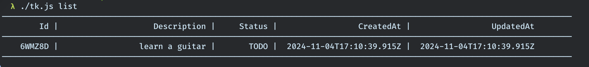

# [task tracker app](https://roadmap.sh/projects/task-tracker)

A command-line interface (CLI) tool for managing tasks. This tool allows you to add, update, delete, and change the status of tasks, as well as list tasks by their status.

## Installation

Clone the repository and navigate to the project directory. Then, install the necessary dependencies:

```bash
npm install
```
## Build
```bash
npm run build
```
This will compile the project in dist folder. 

```bash
cd dist
chmod +x tk.js
```

## Usage

```bash
./tk.js
```
### Add Task
```bash 
./tk.js add <description>
```

### Update Task
```bash
./tk.js update <taskId> <description>
```

### Delete Task
```bash
./tk.js delete <taskId>
```

### Mark a task as in progress
```bash
./tk.js mark-in-progress <taskId>
```

### Mark a task as done
```bash
./tk.js mark-done <taskId>
```

### List tasks by status
```bash
./tk.js list [done | todo | in-progress]
```

#### Lists tasks filtered by their status:

* done - Completed tasks
* todo - Tasks that have not started
* in-progress - Tasks that are currently in progress


### Screenshots



